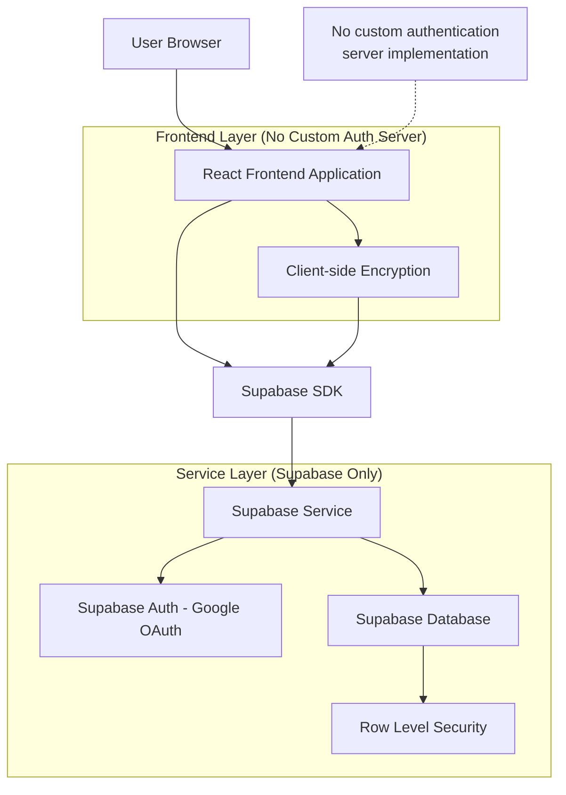
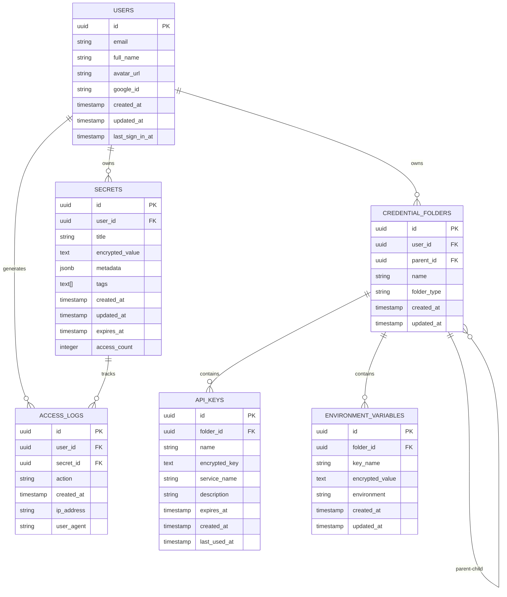

# Secret Key Manager - Technical Architecture Document

## 1. Architecture Design



## 2. Technology Description

* **Frontend**: React\@18 + TypeScript + Tailwind CSS\@3 + Vite + Zustand (state management)

* **Authentication**: Supabase Auth (Google OAuth) - No custom authentication server

* **Database**: Supabase PostgreSQL with Row Level Security

* **Encryption**: Web Crypto API for client-side AES-256-GCM encryption

* **UI Components**: Headless UI + Heroicons for consistent design

* **Form Handling**: React Hook Form with Zod validation

## 3. Route Definitions

| Route           | Purpose                                                        |
| --------------- | -------------------------------------------------------------- |
| /               | Landing page with app overview and Google OAuth login          |
| /auth/callback  | Supabase Auth OAuth callback handler (no custom server logic) |
| /dashboard      | Main dashboard showing secrets overview and quick actions      |
| /secrets        | Secret management page with list, create, edit functionality   |
| /secrets/:id    | Individual secret details page with decryption and metadata    |
| /credentials    | Credentials management page with folder organization and API keys |
| /settings       | User settings including account, security, and data management |

## 4. API Definitions

### 4.1 Core API

**Authentication (Supabase Auth Only - No Custom Auth Server)**

All authentication is handled exclusively by Supabase Auth service. No custom authentication endpoints or server-side auth logic is implemented.

```typescript
// Google OAuth sign in with automatic account creation
supabase.auth.signInWithOAuth({
  provider: 'google',
  options: {
    redirectTo: `${window.location.origin}/auth/callback`
  }
})

// Sign out
supabase.auth.signOut()

// Get current user session
supabase.auth.getSession()

// Get user profile (auto-populated from Google)
supabase.auth.getUser()

// Listen to auth state changes
supabase.auth.onAuthStateChange((event, session) => {
  // Handle auth state changes
})
```

**Secret Management (Supabase Database)**

```typescript
// Create secret
supabase.from('secrets').insert({
  title: string,
  encrypted_value: string,
  metadata: object,
  tags: string[],
  expires_at?: string
})

// Get user secrets
supabase.from('secrets')
  .select('*')
  .eq('user_id', userId)

// Update secret
supabase.from('secrets')
  .update({ encrypted_value, metadata })
  .eq('id', secretId)
  .eq('user_id', userId)

// Delete secret
supabase.from('secrets')
  .delete()
  .eq('id', secretId)
  .eq('user_id', userId)
```

**Credentials Management (Supabase Database)**

```typescript
// Create credential folder
supabase.from('credential_folders').insert({
  name: string,
  parent_id?: string,
  folder_type: 'api_keys' | 'env_vars' | 'general'
})

// Get user credential folders
supabase.from('credential_folders')
  .select('*')
  .eq('user_id', userId)

// Store API key in folder
supabase.from('api_keys').insert({
  folder_id: string,
  name: string,
  encrypted_key: string,
  service_name: string,
  expires_at?: string
})

// Get environment variables
supabase.from('environment_variables')
  .select('*')
  .eq('folder_id', folderId)
```

### 4.2 TypeScript Interfaces

```typescript
interface Secret {
  id: string;
  user_id: string;
  title: string;
  encrypted_value: string;
  metadata: {
    description?: string;
    url?: string;
    username?: string;
  };
  tags: string[];
  created_at: string;
  updated_at: string;
  expires_at?: string;
  access_count: number;
}

interface User {
  id: string;
  email: string;
  full_name?: string;
  avatar_url?: string;
  google_id: string;
  created_at: string;
  last_sign_in_at?: string;
}

interface CredentialFolder {
  id: string;
  user_id: string;
  name: string;
  parent_id?: string;
  folder_type: 'api_keys' | 'env_vars' | 'general';
  created_at: string;
  updated_at: string;
}

interface ApiKey {
  id: string;
  folder_id: string;
  name: string;
  encrypted_key: string;
  service_name: string;
  description?: string;
  expires_at?: string;
  created_at: string;
  last_used_at?: string;
}

interface EnvironmentVariable {
  id: string;
  folder_id: string;
  key_name: string;
  encrypted_value: string;
  environment: 'development' | 'staging' | 'production';
  created_at: string;
  updated_at: string;
}

interface EncryptionKey {
  key: CryptoKey;
  salt: Uint8Array;
}
```

## 5. Data Model

### 5.1 Data Model Definition



### 5.2 Data Definition Language

**Secrets Table**

```sql
-- Create secrets table
CREATE TABLE secrets (
    id UUID PRIMARY KEY DEFAULT gen_random_uuid(),
    user_id UUID NOT NULL REFERENCES auth.users(id) ON DELETE CASCADE,
    title VARCHAR(255) NOT NULL,
    encrypted_value TEXT NOT NULL,
    metadata JSONB DEFAULT '{}',
    tags TEXT[] DEFAULT '{}',
    created_at TIMESTAMP WITH TIME ZONE DEFAULT NOW(),
    updated_at TIMESTAMP WITH TIME ZONE DEFAULT NOW(),
    expires_at TIMESTAMP WITH TIME ZONE,
    access_count INTEGER DEFAULT 0
);

-- Create indexes
CREATE INDEX idx_secrets_user_id ON secrets(user_id);
CREATE INDEX idx_secrets_created_at ON secrets(created_at DESC);
CREATE INDEX idx_secrets_expires_at ON secrets(expires_at) WHERE expires_at IS NOT NULL;
CREATE INDEX idx_secrets_tags ON secrets USING GIN(tags);

-- Row Level Security policies
ALTER TABLE secrets ENABLE ROW LEVEL SECURITY;

-- Policy: Users can only access their own secrets
CREATE POLICY "Users can manage their own secrets" ON secrets
    FOR ALL USING (auth.uid() = user_id);

-- Grant permissions
GRANT SELECT ON secrets TO anon;
GRANT ALL PRIVILEGES ON secrets TO authenticated;
```

**Credential Folders Table**

```sql
-- Create credential folders table
CREATE TABLE credential_folders (
    id UUID PRIMARY KEY DEFAULT gen_random_uuid(),
    user_id UUID NOT NULL REFERENCES auth.users(id) ON DELETE CASCADE,
    parent_id UUID REFERENCES credential_folders(id) ON DELETE CASCADE,
    name VARCHAR(255) NOT NULL,
    folder_type VARCHAR(20) NOT NULL CHECK (folder_type IN ('api_keys', 'env_vars', 'general')),
    created_at TIMESTAMP WITH TIME ZONE DEFAULT NOW(),
    updated_at TIMESTAMP WITH TIME ZONE DEFAULT NOW()
);

-- Create indexes
CREATE INDEX idx_credential_folders_user_id ON credential_folders(user_id);
CREATE INDEX idx_credential_folders_parent_id ON credential_folders(parent_id);
CREATE INDEX idx_credential_folders_type ON credential_folders(folder_type);

-- Row Level Security
ALTER TABLE credential_folders ENABLE ROW LEVEL SECURITY;

CREATE POLICY "Users can manage their own credential folders" ON credential_folders
    FOR ALL USING (auth.uid() = user_id);

-- Grant permissions
GRANT SELECT ON credential_folders TO anon;
GRANT ALL PRIVILEGES ON credential_folders TO authenticated;
```

**API Keys Table**

```sql
-- Create API keys table
CREATE TABLE api_keys (
    id UUID PRIMARY KEY DEFAULT gen_random_uuid(),
    folder_id UUID NOT NULL REFERENCES credential_folders(id) ON DELETE CASCADE,
    name VARCHAR(255) NOT NULL,
    encrypted_key TEXT NOT NULL,
    service_name VARCHAR(100) NOT NULL,
    description TEXT,
    expires_at TIMESTAMP WITH TIME ZONE,
    created_at TIMESTAMP WITH TIME ZONE DEFAULT NOW(),
    last_used_at TIMESTAMP WITH TIME ZONE
);

-- Create indexes
CREATE INDEX idx_api_keys_folder_id ON api_keys(folder_id);
CREATE INDEX idx_api_keys_service ON api_keys(service_name);
CREATE INDEX idx_api_keys_expires_at ON api_keys(expires_at) WHERE expires_at IS NOT NULL;

-- Row Level Security
ALTER TABLE api_keys ENABLE ROW LEVEL SECURITY;

CREATE POLICY "Users can manage API keys in their folders" ON api_keys
    FOR ALL USING (
        EXISTS (
            SELECT 1 FROM credential_folders 
            WHERE credential_folders.id = api_keys.folder_id 
            AND credential_folders.user_id = auth.uid()
        )
    );

-- Grant permissions
GRANT SELECT ON api_keys TO anon;
GRANT ALL PRIVILEGES ON api_keys TO authenticated;
```

**Environment Variables Table**

```sql
-- Create environment variables table
CREATE TABLE environment_variables (
    id UUID PRIMARY KEY DEFAULT gen_random_uuid(),
    folder_id UUID NOT NULL REFERENCES credential_folders(id) ON DELETE CASCADE,
    key_name VARCHAR(255) NOT NULL,
    encrypted_value TEXT NOT NULL,
    environment VARCHAR(20) NOT NULL CHECK (environment IN ('development', 'staging', 'production')),
    created_at TIMESTAMP WITH TIME ZONE DEFAULT NOW(),
    updated_at TIMESTAMP WITH TIME ZONE DEFAULT NOW()
);

-- Create indexes
CREATE INDEX idx_env_vars_folder_id ON environment_variables(folder_id);
CREATE INDEX idx_env_vars_environment ON environment_variables(environment);
CREATE INDEX idx_env_vars_key_name ON environment_variables(key_name);

-- Row Level Security
ALTER TABLE environment_variables ENABLE ROW LEVEL SECURITY;

CREATE POLICY "Users can manage env vars in their folders" ON environment_variables
    FOR ALL USING (
        EXISTS (
            SELECT 1 FROM credential_folders 
            WHERE credential_folders.id = environment_variables.folder_id 
            AND credential_folders.user_id = auth.uid()
        )
    );

-- Grant permissions
GRANT SELECT ON environment_variables TO anon;
GRANT ALL PRIVILEGES ON environment_variables TO authenticated;
```

**Access Logs Table**

```sql
-- Create access logs table for audit trail
CREATE TABLE access_logs (
    id UUID PRIMARY KEY DEFAULT gen_random_uuid(),
    user_id UUID NOT NULL REFERENCES auth.users(id) ON DELETE CASCADE,
    secret_id UUID REFERENCES secrets(id) ON DELETE CASCADE,
    action VARCHAR(50) NOT NULL,
    created_at TIMESTAMP WITH TIME ZONE DEFAULT NOW(),
    ip_address INET,
    user_agent TEXT
);

-- Create indexes
CREATE INDEX idx_access_logs_user_id ON access_logs(user_id);
CREATE INDEX idx_access_logs_secret_id ON access_logs(secret_id);
CREATE INDEX idx_access_logs_created_at ON access_logs(created_at DESC);

-- Row Level Security
ALTER TABLE access_logs ENABLE ROW LEVEL SECURITY;

CREATE POLICY "Users can view their own access logs" ON access_logs
    FOR SELECT USING (auth.uid() = user_id);

-- Grant permissions
GRANT SELECT ON access_logs TO anon;
GRANT ALL PRIVILEGES ON access_logs TO authenticated;
```

**Database Functions**

```sql
-- Function to update access count and log access
CREATE OR REPLACE FUNCTION increment_access_count(secret_uuid UUID)
RETURNS void AS $$
BEGIN
    UPDATE secrets 
    SET access_count = access_count + 1,
        updated_at = NOW()
    WHERE id = secret_uuid AND user_id = auth.uid();
    
    INSERT INTO access_logs (user_id, secret_id, action)
    VALUES (auth.uid(), secret_uuid, 'view');
END;
$$ LANGUAGE plpgsql SECURITY DEFINER;

-- Function to clean up expired secrets and API keys
CREATE OR REPLACE FUNCTION cleanup_expired_items()
RETURNS void AS $$
BEGIN
    -- Clean up expired secrets
    DELETE FROM secrets 
    WHERE expires_at IS NOT NULL AND expires_at < NOW();
    
    -- Clean up expired API keys
    DELETE FROM api_keys 
    WHERE expires_at IS NOT NULL AND expires_at < NOW();
END;
$$ LANGUAGE plpgsql;

-- Function to create default credential folders for new users
CREATE OR REPLACE FUNCTION create_default_credential_folders()
RETURNS TRIGGER AS $$
BEGIN
    -- Create default folders for new user
    INSERT INTO credential_folders (user_id, name, folder_type) VALUES
        (NEW.id, 'API Keys', 'api_keys'),
        (NEW.id, 'Environment Variables', 'env_vars'),
        (NEW.id, 'General Credentials', 'general');
    
    RETURN NEW;
END;
$$ LANGUAGE plpgsql SECURITY DEFINER;

-- Trigger to create default folders on user creation
CREATE TRIGGER create_user_default_folders
    AFTER INSERT ON auth.users
    FOR EACH ROW
    EXECUTE FUNCTION create_default_credential_folders();
```

## 6. Security Implementation

**Note: Authentication is handled exclusively by Supabase Auth service. No custom authentication server or endpoints are implemented in this application.**

### 6.1 Client-side Encryption

```typescript
// Encryption utility using Web Crypto API
class EncryptionService {
  private static async deriveKey(password: string, salt: Uint8Array): Promise<CryptoKey> {
    const encoder = new TextEncoder();
    const keyMaterial = await crypto.subtle.importKey(
      'raw',
      encoder.encode(password),
      'PBKDF2',
      false,
      ['deriveKey']
    );
    
    return crypto.subtle.deriveKey(
      {
        name: 'PBKDF2',
        salt: salt,
        iterations: 100000,
        hash: 'SHA-256'
      },
      keyMaterial,
      { name: 'AES-GCM', length: 256 },
      false,
      ['encrypt', 'decrypt']
    );
  }
  
  static async encrypt(plaintext: string, password: string): Promise<string> {
    const salt = crypto.getRandomValues(new Uint8Array(16));
    const iv = crypto.getRandomValues(new Uint8Array(12));
    const key = await this.deriveKey(password, salt);
    
    const encoder = new TextEncoder();
    const encrypted = await crypto.subtle.encrypt(
      { name: 'AES-GCM', iv: iv },
      key,
      encoder.encode(plaintext)
    );
    
    // Combine salt + iv + encrypted data
    const combined = new Uint8Array(salt.length + iv.length + encrypted.byteLength);
    combined.set(salt, 0);
    combined.set(iv, salt.length);
    combined.set(new Uint8Array(encrypted), salt.length + iv.length);
    
    return btoa(String.fromCharCode(...combined));
  }
  
  static async decrypt(encryptedData: string, password: string): Promise<string> {
    const combined = new Uint8Array(
      atob(encryptedData).split('').map(char => char.charCodeAt(0))
    );
    
    const salt = combined.slice(0, 16);
    const iv = combined.slice(16, 28);
    const encrypted = combined.slice(28);
    
    const key = await this.deriveKey(password, salt);
    
    const decrypted = await crypto.subtle.decrypt(
      { name: 'AES-GCM', iv: iv },
      key,
      encrypted
    );
    
    const decoder = new TextDecoder();
    return decoder.decode(decrypted);
  }
}
```

### 6.2 Security Best Practices

* **Zero-knowledge architecture**: Server never receives plaintext secrets

* **Client-side encryption**: All encryption/decryption happens in the browser

* **Secure key derivation**: PBKDF2 with 100,000 iterations and random salt

* **Supabase Auth integration**: Google OAuth handled entirely by Supabase Auth service

* **No custom auth server**: Authentication logic is completely delegated to Supabase

* **Row Level Security**: Database-level access controls via Supabase RLS policies

* **Session management**: Automatic token refresh and secure logout via Supabase SDK

* **Input validation**: Comprehensive validation using Zod schemas

* **HTTPS enforcement**: All communication over encrypted connections

* **Content Security Policy**: Strict CSP headers to prevent XSS attacks

## 7. Project Structure for Credential Management

### 7.1 Recommended Folder Hierarchy

```
secret-key-manager/
├── credentials/
│   ├── development/
│   │   ├── api-keys/
│   │   │   ├── google-oauth.env
│   │   │   ├── supabase.env
│   │   │   └── third-party-services.env
│   │   ├── database/
│   │   │   └── supabase-connection.env
│   │   └── environment-variables/
│   │       └── app-config.env
│   ├── staging/
│   │   ├── api-keys/
│   │   ├── database/
│   │   └── environment-variables/
│   ├── production/
│   │   ├── api-keys/
│   │   ├── database/
│   │   └── environment-variables/
│   └── shared/
│       ├── encryption-keys/
│       └── certificates/
├── src/
├── public/
└── package.json
```

### 7.2 Security Guidelines for Credential Storage

* **Environment-specific separation**: Separate folders for development, staging, and production
* **Service categorization**: Group credentials by service type (API keys, database, etc.)
* **Encrypted storage**: All credential files should be encrypted at rest
* **Access control**: Implement proper file permissions (600 for credential files)
* **Version control exclusion**: Add credentials/ folder to .gitignore
* **Backup strategy**: Secure backup of encrypted credential files
* **Rotation policy**: Regular rotation of API keys and secrets with expiration tracking

