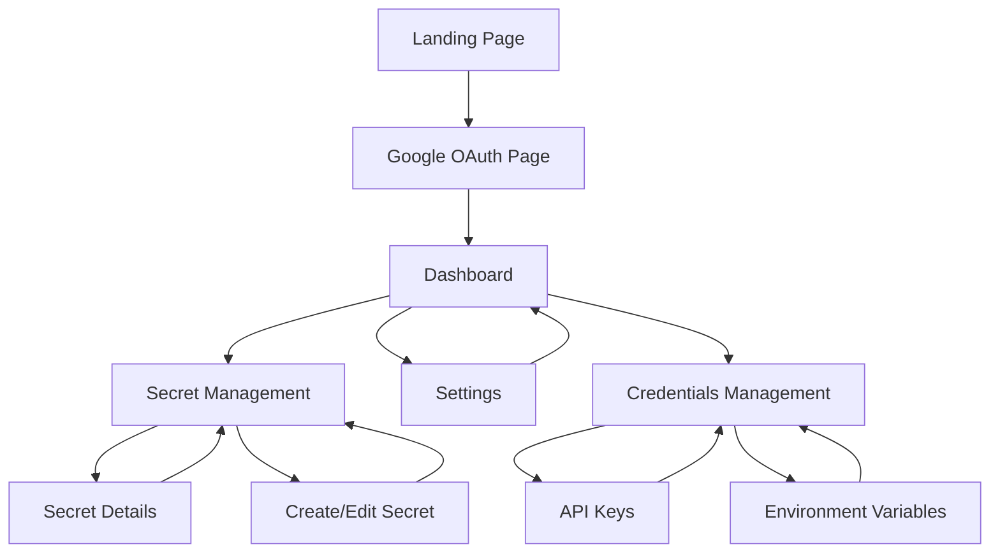

# Secret Key Manager - Product Requirements Document

## 1. Product Overview

A secure web application that enables users to store, manage, and retrieve encrypted secret keys with enterprise-grade security. The application provides a user-friendly interface for managing sensitive data like API keys, passwords, and tokens while ensuring zero-knowledge architecture where only the user can decrypt their data.

The product solves the critical problem of secure secret management for developers and teams who need to store sensitive credentials safely. Target users include developers, DevOps engineers, and small to medium-sized teams requiring secure credential storage with proper access controls.

## 2. Core Features

### 2.1 User Roles

| Role               | Registration Method                           | Core Permissions                                                          |
| ------------------ | --------------------------------------------- | ------------------------------------------------------------------------- |
| Authenticated User | Google OAuth via Supabase Auth (automatic account creation) | Can create, read, update, delete own secret keys; manage account settings |
| Anonymous User     | No registration                               | Can only access Google login page                                        |

### 2.2 Feature Module

Our secret key management application consists of the following main pages:

1. **Authentication page**: Google OAuth login button, automatic account creation flow.
2. **Dashboard page**: secret keys overview, quick actions, usage statistics, security status.
3. **Secret management page**: create new secrets, edit existing secrets, delete secrets, search and filter.
4. **Secret details page**: view encrypted secret, copy to clipboard, edit metadata, access history.
5. **Settings page**: account management, security settings, encryption key management, export/import.
6. **Credentials management page**: organize API keys, environment variables in structured folders.

### 2.3 Page Details

| Page Name         | Module Name       | Feature description                                                                        |
| ----------------- | ----------------- | ------------------------------------------------------------------------------------------ |
| Authentication    | Google OAuth      | Authenticate users with Google OAuth, automatically create accounts on first login, handle OAuth errors |
| Dashboard         | Overview Cards    | Display total secrets count, recent activity, security alerts, quick access buttons        |
| Dashboard         | Recent Activity   | Show last accessed secrets, recent modifications, security events with timestamps          |
| Secret Management | Secret List       | Display encrypted secrets with metadata, search/filter functionality, bulk operations      |
| Secret Management | Create Secret     | Add new secret with title, encrypted value, tags, expiration date, access controls         |
| Secret Management | Edit Secret       | Modify existing secret metadata, update encrypted value, change permissions                |
| Secret Details    | View Secret       | Display decrypted secret (client-side), copy to clipboard, show access history             |
| Secret Details    | Metadata Panel    | Show creation date, last modified, tags, expiration status, access count                   |
| Settings          | Account Settings  | Update profile information, manage Google account linking, email preferences                      |
| Settings          | Security Settings | View active sessions, manage API tokens, encryption settings, Google account security                |
| Settings          | Data Management   | Export encrypted data, import secrets, delete account with data purging                    |
| Credentials       | Folder Management | Create, organize, and manage credential folders for different environments and projects     |
| Credentials       | API Key Storage   | Store and categorize API keys with metadata, expiration tracking, usage monitoring         |
| Credentials       | Environment Variables | Manage environment-specific variables with secure storage and easy deployment integration |

## 3. Core Process

**User Registration and Authentication Flow:**

1. User visits application and is redirected to Google OAuth authentication page
2. User clicks "Sign in with Google" button and completes OAuth flow
3. Supabase Auth handles Google OAuth verification and automatically creates user account on first login
4. Upon successful authentication, user is redirected to dashboard with profile auto-populated from Google
5. User can access all protected routes with valid session

**Secret Management Flow:**

1. User navigates to secret management page from dashboard
2. User can create new secret by providing title, value, and metadata
3. Secret value is encrypted client-side before sending to Supabase
4. User can view, edit, or delete existing secrets with proper decryption
5. All operations include proper error handling and security validations

## 4. User Interface Design

### 4.1 Design Style

* **Primary Colors**: Deep blue (#1e40af) for trust and security, white (#ffffff) for clean backgrounds

* **Secondary Colors**: Green (#10b981) for success states, red (#ef4444) for errors, amber (#f59e0b) for warnings

* **Button Style**: Rounded corners (8px), solid fills for primary actions, outlined for secondary actions

* **Font**: Inter font family, 16px base size for body text, 24px+ for headings

* **Layout Style**: Card-based design with subtle shadows, top navigation with sidebar for main sections

* **Icons**: Heroicons for consistency, lock/shield icons for security emphasis, eye/eye-slash for visibility toggles

### 4.2 Page Design Overview

| Page Name         | Module Name     | UI Elements                                                                                      |
| ----------------- | --------------- | ------------------------------------------------------------------------------------------------ |
| Authentication    | Google OAuth    | Centered card layout with Google branding, "Sign in with Google" button, OAuth consent flow     |
| Dashboard         | Overview Cards  | Grid layout with metric cards, blue accent borders, icon + number + label format                 |
| Dashboard         | Recent Activity | Timeline-style list with timestamps, action icons, expandable details                            |
| Secret Management | Secret List     | Table/card hybrid view, search bar with filters, action buttons (view/edit/delete)               |
| Secret Management | Create Form     | Modal overlay with form fields, encryption status indicator, save/cancel buttons                 |
| Secret Details    | View Panel      | Split layout with metadata sidebar, main content area with copy button, masked/unmasked toggle   |
| Settings          | Account Section | Form layout with grouped settings, Google profile integration, confirmation dialogs for destructive actions |
| Credentials       | Folder Tree     | Hierarchical folder structure with expand/collapse, drag-drop organization, color-coded categories |
| Credentials       | Key Management  | Card-based layout for API keys, status indicators, quick copy buttons, expiration warnings       |

### 4.3 Responsiveness

The application is mobile-first responsive design with breakpoints at 640px (mobile), 768px (tablet), and 1024px (desktop). Touch-friendly interactions are optimized for mobile devices with larger tap targets and swipe gestures for secret management actions.

## 5. Security Requirements

### 5.1 Encryption Strategy

* Client-side encryption using AES-256-GCM before data transmission

* User-derived encryption keys using PBKDF2 with high iteration count

* Zero-knowledge architecture where server never sees plaintext secrets

* Secure key derivation from user password with salt

### 5.2 Access Controls

* Row Level Security (RLS) policies in Supabase ensuring users only access own data

* Session-based authentication with automatic token refresh

* HTTPS-only communication with proper CORS configuration

* Input validation and sanitization on both client and server sides

### 5.3 Security Warnings

* Clear indicators when secrets are visible vs. masked

* Warnings before copying sensitive data to clipboard

* Session timeout notifications with auto-logout

* Security alerts for suspicious activities or failed login attempts

